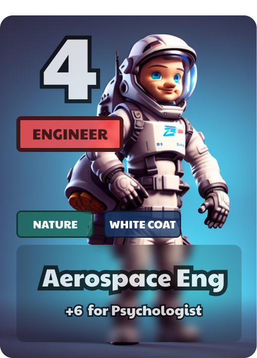

# 🃏 Pali - 3D Multiplayer Godot Card Game

Pali a 3D multiplayer Godot trade card game (TCG).

This repository holds everything needed to export and run a personal dedicated server for the game, and game clients.

## Rules for the game

- Goal of the game is to build a hand of 5 cards that exceeds the points of your opponents 5 cards in their hand.
- The game has 25 cards total and starts by dealing 5 cards randomly to each player.
- It is turn based, every turn, you can either:
  1.  Place a card from your hand on the table
  2.  or switch a card from the table with one in your hand.
- When there are no more cards in the deck, the game is over and points are tallied to determine the winner.

### Point counting

- Every card has a point value near the top to represent their base points
- Every card also has a "category", in this example it is "Engineer" for the Aerospace Engineer card. **For every other card in your hand that is also an engineer, you get another +2 points added to your hand.**
- Some cards may optionally have some "tags". In this example, the Aerospace engineer card has 2 tags, "Nature" and "White Coat". **For every other card in your hand that has the same tag, you get an additonal +1 point added to your hand.**
- Finally, cards have a special relationship with 1 or 2 other cards in the game that are in different categories. For this example, the Aerospace Engineer gets a +6 point boost if you also have the "Psychologist" card in your hand.

Points are automatically calculated and shown in the bottom right/left sides of the screen.

### Controls

There are minimal controls:

- Left mouse clicking - click to select card in hand, then click empty space on table to place card, or, click another card on table to show a popup to confirm a switch
- Z - to zoom into the table and get a better view to read the cards on the table

## How to export dedicated server

## Credits

- The 3D assets are from [@KayLousberg](https://twitter.com/KayLousberg) from their "furniture bits" [itch.io](https://kaylousberg.itch.io/furniture-bits) page
- UI font is Noto Sans, available from [Google Fonts](https://fonts.google.com/noto/specimen/Noto+Sans)
- Card flip sounds are from [freesound.org](https://freesound.org/)
- Card images were generted using A.I, from the tool [Layer](https://www.layer.ai)
- Everything else was created from scratch by Jason Rametta in Blender or other softwares
